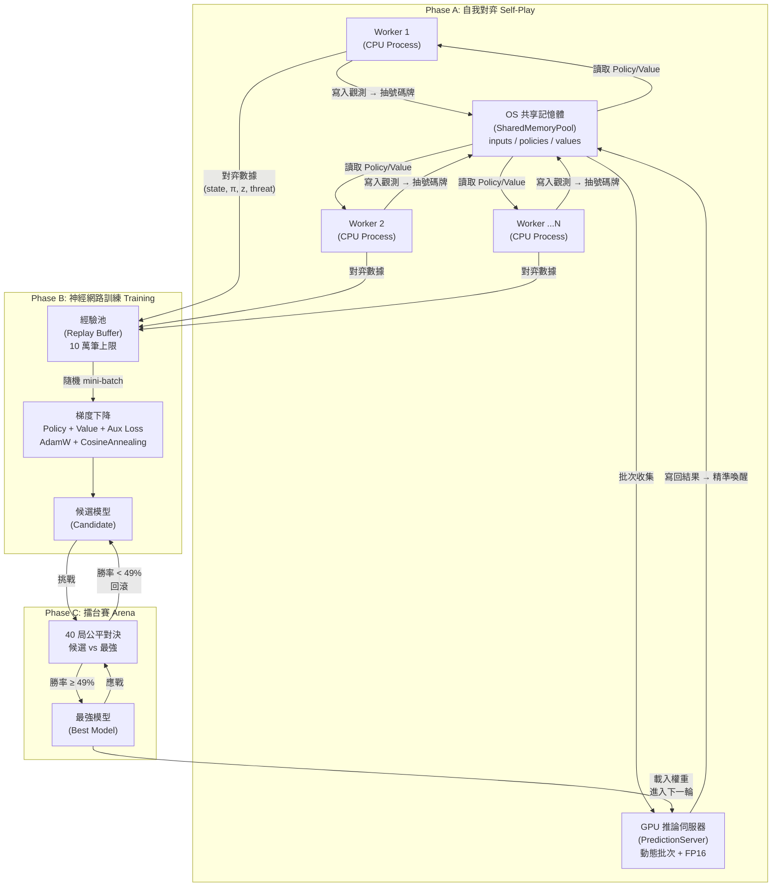
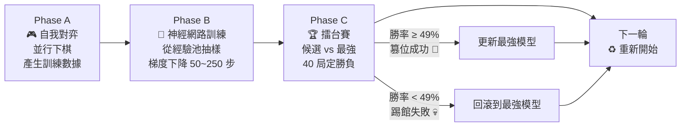

# 🎮 AlphaZero 五子棋 v7「純零」— 完全自學的棋類 AI 引擎

> **從零開始，不靠任何人類棋譜，純粹透過自我對弈，訓練出超越人類的五子棋智慧。**

```
    ╔══════════════════════════════════════════════════════╗
    ║   AlphaZero Gomoku v7 "Pure Zero"                   ║
    ║   10-Layer ResNet-SE + MCTS + VCF                   ║
    ║   Self-Play → Train → Arena → Evolve                ║
    ╚══════════════════════════════════════════════════════╝
```

---

## 📖 目錄

- [第一章：幼稚園篇 — 用生活比喻理解 AI 下棋](#第一章幼稚園篇--用生活比喻理解-ai-下棋)
- [第二章：高中生篇 — 基礎理論與名詞解釋](#第二章高中生篇--基礎理論與名詞解釋)
- [第三章：資工系篇 — 系統架構與資料流](#第三章資工系篇--系統架構與資料流)
- [第四章：資深工程師篇 — 模組深度解析](#第四章資深工程師篇--模組深度解析)
- [第五章：博士班篇 — 超參數、數學公式與設計哲學](#第五章博士班篇--超參數數學公式與設計哲學)
- [附錄：快速上手指南](#附錄快速上手指南)

---

# 第一章：幼稚園篇 — 用生活比喻理解 AI 下棋

> 🎯 **本章目標**：完全不提程式碼，用日常生活的故事讓你明白這個專案到底在做什麼。

## 🐶 比喻一：訓練一隻小狗學才藝

想像你領養了一隻剛出生的小狗（AI），你想教牠下五子棋。

問題是：**你自己也不會下五子棋。** 你沒有棋譜、沒有老師、什麼都沒有。

那怎麼辦？AlphaZero 的天才方法是這樣的：

### 1️⃣ 給小狗一面鏡子（自我對弈）

你在鏡子前面放一個棋盤，讓小狗**自己跟鏡子裡的自己下棋**。一開始牠亂下一通，棋子扔得到處都是。但每一盤結束後，牠會記住：

*   「剛才那步下在角落，最後輸了 ➔ 下次不要這樣下。」
*   「剛才那步下在中間，最後贏了 ➔ 下次多試試。」

### 2️⃣ 給小狗一本筆記本（神經網路）

小狗的腦袋（神經網路）會把每一盤棋的經驗記下來。時間一久，牠的腦袋裡就形成了一套「直覺」：

*   **策略直覺**（Policy）：「看到這個局面，我第一反應應該下在這裡。」
*   **勝算直覺**（Value）：「看到這個局面，我覺得我大概有 70% 的機率會贏。」

### 3️⃣ 給小狗一個沙盤推演室（MCTS 搜尋樹）

光靠直覺還不夠。在真正落子之前，小狗會在腦海中**模擬好幾百種未來的走法**，看看每一步會導致什麼結果。這就像是將軍在作戰前，先在沙盤上推演各種戰術一樣。

### 4️⃣ 定期比武大會（Arena 擂台賽）

每隔一段時間，「現在的小狗」會跟「上一版最強的小狗」打一場比武大賽。如果新的贏了，牠就正式「篡位」成為新王；如果輸了，就打回原形重新練習。

### 🏆 最終結果

經過成千上萬盤的自我對弈，這隻小狗——**從一個什麼都不會的笨蛋，變成了一個連人類高手都難以擊敗的五子棋大師。**

而且最神奇的是：**全程沒有任何人類教牠任何一步棋。** 牠完全是自己悟出來的。

---

## 🍳 比喻二：經營一間自學成才的餐廳

| 餐廳比喻 | 對應到 AlphaZero |
| :--- | :--- |
| 廚師（完全不會做菜） | 神經網路（隨機初始化） |
| 每天自己做菜自己試吃 | 自我對弈（Self-Play） |
| 記下「好吃/難吃」的筆記 | 經驗池（Replay Buffer） |
| 翻筆記改良食譜 | 梯度下降訓練（Training） |
| 請美食評審來試吃 | 擂台賽（Arena） |
| 通過評審 ➔ 升級為主廚 | 模型篡位（Best Model Update） |
| 沒通過 ➔ 回去繼續練 | 模型回滾（Rollback） |

---

## 📦 這個程式的輸入與輸出

| 項目 | 內容 |
| :--- | :--- |
| **輸入** | 什麼都不需要！只需要五子棋的規則。 |
| **過程** | AI 自己跟自己下棋數千萬盤，從中學習。 |
| **輸出** | 一個訓練好的「大腦檔案」（`best_model.pth`），可以跟人類對戰。 |

---

# 第二章：高中生篇 — 基礎理論與名詞解釋

> 🎯 **本章目標**：建立你看懂程式碼所需的知識庫。每一個專有名詞都會用白話文解釋。

## 🧠 核心技術一覽表

| # | 技術名稱 | 白話文解釋 | 在本專案的角色 |
| :--- | :--- | :--- | :--- |
| 1 | 神經網路（Neural Network） | 模仿人腦的數學模型，由很多層「神經元」組成，可以從大量資料中學習規律。 | AI 的「大腦」，接收棋盤畫面，輸出「下哪裡」和「能不能贏」的判斷。 |
| 2 | 卷積神經網路（CNN） | 專門處理「圖片」的神經網路。用一個小窗口滑過整張圖，提取局部特徵（邊角、線條等）。 | 把 15x15 的棋盤當作一張圖片來「看」，辨識棋型（活三、衝四等）。 |
| 3 | 殘差網路（ResNet） | 在 CNN 中加入「捷徑連接」，讓資訊可以跳過某些層直接傳遞，解決網路太深學不動的問題。 | 我們的骨幹網路用了 10 層 ResNet，讓 AI 能「看得更深」而不會學壞。 |
| 4 | 注意力機制（SE Block） | 讓網路學會「哪些特徵比較重要」，自動放大重要的、壓小不重要的。 | 每一層 ResNet 都配備了 SE Block，讓 AI 自動聚焦在關鍵棋型上。 |
| 5 | 強化學習（RL） | 不靠標準答案學習，而是透過「嘗試 ➔ 得到獎勵/懲罰 ➔ 調整行為」的循環來學習。 | 整個訓練的核心哲學：AI 下贏了得 +1 分，下輸了得 -1 分，從中學習。 |
| 6 | 蒙地卡羅樹搜尋（MCTS） | 在腦海中模擬大量隨機的未來走法（蒙地卡羅 = 隨機抽樣），統計哪步棋最有前途。 | AI 落子前的「深度思考」引擎。每步棋模擬 200~1000 次未來。 |
| 7 | 反向傳播（Backpropagation） | 計算出「預測值」和「正確答案」之間的差距，然後從輸出層逆向往回調整每一層的參數。 | 訓練時的核心演算法：把 MCTS 得出的「正解」回灌給神經網路學習。 |
| 8 | 損失函數（Loss Function） | 一個衡量「AI 的預測有多爛」的數字。數字越小，代表 AI 越準。訓練的目標就是把這個數字壓到最低。 | 我們有三個損失：策略損失、價值損失、輔助損失。 |
| 9 | 探索與利用（Explore vs Exploit） | 「利用」= 選已知最好的；「探索」= 冒險嘗試新的。太偏任何一邊都會出問題。 | MCTS 的 UCB 公式和 Dirichlet 噪聲就是在平衡這兩者。 |
| 10 | 經驗池（Replay Buffer） | 一個大型「記憶倉庫」，存放過去所有對弈的經驗。訓練時從中隨機抽取一批來學習。 | 100,000 筆容量的連續 NumPy 陣列環形緩衝區，自動淘汰最舊的資料。 |
| 11 | VCF 連殺（Victory by Continuous Fours） | 五子棋的必勝戰術：不斷下出「衝四」（四顆連線 + 一個空位），迫使對手只能被動堵住，直到無法防守。 | 作為「戰術雷達」，在 MCTS 搜尋前先偵測是否存在必勝殺招。 |
| 12 | 禁手（Forbidden Moves） | 五子棋特有規則：黑棋（先手）不能下出「雙三」「雙四」「長連（超過五顆）」，否則直接判負。 | `board_utils.py` 中用精密的射線分析引擎來偵測和過濾禁手。 |
| 13 | 混合精度訓練（AMP） | 用半精度浮點數（FP16）進行計算，速度快一倍，記憶體省一半，但精度幾乎不損失。 | 顯卡推論和訓練都啟用了 `torch.amp`，8GB VRAM 也能跑。 |
| 14 | 共享記憶體（Shared Memory） | 作業系統層級的記憶體分享機制，多個程式可以直接讀寫同一塊記憶體，不需要複製和序列化。 | Worker 和 GPU 推論引擎之間的「零拷貝高速公路」。 |

---

## 🎓 AlphaZero 的三大支柱

理解整個系統只需要記住三件事：

```
┌─────────────────────────────────────────────────────────────┐
│                    AlphaZero = 三合一                        │
│                                                             │
│   🧠 神經網路        +     🌳 MCTS 搜尋     +    🔄 自我對弈  │
│   (直覺判斷)              (深度思考)              (產生經驗)   │
│                                                             │
│   「我覺得這步好」    「讓我模擬 800 次     「自己跟自己下，     │
│                         確認一下」            越打越強」       │
└─────────────────────────────────────────────────────────────┘
```

1.  **神經網路**提供「快速但粗略」的直覺。
2.  **MCTS** 利用這個直覺去做「慢速但精確」的深度搜尋。
3.  **自我對弈**不斷產生新的訓練資料，讓神經網路的直覺越來越準。

這三者形成一個**正向飛輪**：直覺越準 ➔ 搜尋越有效率 ➔ 對弈品質越高 ➔ 訓練資料越好 ➔ 直覺更準 ➔ ... 無限循環進化。

---

# 第三章：資工系篇 — 系統架構與資料流

> 🎯 **本章目標**：掌握程式碼的宏觀架構。你將看到一幅完整的資料流向圖，並理解訓練迴圈的每一個階段。

## 🏗️ 檔案架構總覽

```
五子棋GomokuAlphaZero/
├── board_utils.py          # 🧱 地基：Numba 加速的棋盤運算核心
├── env.py                  # 🎮 環境：OpenAI Gym 五子棋規則封裝（含禁手判定）
├── resnet.py               # 🧠 大腦：10 層 ResNet-SE 三頭神經網路
├── mcts.py                 # 🌳 思考：MCTS 搜尋引擎 + VCF + 轉置表
├── vcf_vct.py              # 🗡️ 殺招：迭代式 DFS VCF 必勝搜索
├── self_play.py            # ⚔️ 對弈：D8 增強 + 經驗池 + 單局控制
├── prediction_server.py    # ⚡ 通訊：零拷貝共享記憶體 GPU 推論伺服器
├── train_gomoku.py         # 🏭 工廠：完整訓練管線 + 儀表板 + 課程排程
├── play_against_ai.py      # 🕹️ 人機：Pygame GUI 人機對戰介面
└── checkpoints/            # 💾 存檔：模型權重檔案與持久化經驗池
    ├── best_model.pth
    ├── latest_model.pth
    └── replay_buffer.pkl
```

## 🔄 系統架構圖



## 🔁 訓練迴圈（每一輪 Iteration）

每一輪迭代由三個階段組成，就像工廠的流水線：



## 📊 資料的一生（資料流向圖）

一筆訓練資料從誕生到被消化的完整旅程：

```
棋盤狀態 (15x15)
    │
    ▼
┌─────────────────────┐
│ env._get_obs_fast() │  ➔ 產生 4 通道觀測張量 (4, 15, 15)
│                     │    Ch0: 我方棋子
│                     │    Ch1: 對手棋子
│                     │    Ch2: 最後落子位置
│                     │    Ch3: 當前顏色標記
└─────────┬───────────┘
          │
          ▼
┌─────────────────────┐
│ MCTS 搜尋引擎       │  ➔ 模擬 N 次未來走法
│ (200~1000 playouts) │  ➔ 輸出搜尋機率分佈 π (225 維向量)
│ + VCF 戰術加成      │  ➔ 輸出 Aux 威脅熱力圖 (15x15)
└─────────┬───────────┘
          │
          ▼
┌─────────────────────┐
│ D8 對稱增強         │  ➔ 4 旋轉 x 2 翻轉 = 8 倍數據量
│ (state, π, z, t)    │  ➔ 存入連續記憶體經驗池 (Replay Buffer)
└─────────┬───────────┘
          │
          ▼
┌─────────────────────┐
│ 隨機抽樣 mini-batch  │  ➔ 1024 筆一組送入 GPU 進行訓練
│ (states, π, z, t)   │
└─────────┬───────────┘
          │
          ▼
┌─────────────────────┐
│ 計算 Loss           │  L = L_policy + 1.0 * L_value + 0.15 * L_aux
│ 反向傳播            │  ➔ 修正神經網路的所有權重
│ 梯度裁剪 (max=5.0)  │  ➔ 防止梯度爆炸
└─────────────────────┘
```

## ⏱️ 四階段課程排程（Curriculum Schedule）

系統會根據當前輪次，自動調整 Worker 進程數、搜尋量、訓練步數等核心參數：

| 階段 | 輪次範圍 | Workers | Playouts | 訓練步數 | 核心策略 |
| :--- | :--- | :--- | :--- | :--- | :--- |
| **Phase A** 快速拓荒 | 0–199 | 16 | 200 | 100 | 16 核海量對局，瘋狂累積資料，快速建構開局庫 |
| **Phase B** 中盤拉扯 | 200–799 | 16 | 400 | 120 | 加深搜尋深度，學習防守反擊與活三防禦 |
| **Phase C** 算力解放 | 800–1599 | 12 | 800 | 250 | 降低 Worker 防止進程碎片化，解鎖 VCF 連殺精算 |
| **Phase D** 死神領域 | 1600–3000 | 12 | 1000 | 250 | 極限深算，防禦力與殘局殺招極限打磨 |

---

# 第四章：資深工程師篇 — 模組深度解析

> 🎯 **本章目標**：拆解每一個核心模組，讓你能指著任何一個 Class 或 Function，完整解釋它的功能與原理。

---

## 模組 1：`board_utils.py` — 棋盤運算核心

**職責**：所有跟「棋盤分析」有關的底層運算，全部集中在這裡。使用 Numba JIT 編譯為 C 語言等級的機器碼，速度比純 Python 快 100 倍以上。

### 關鍵函式

#### `_get_ray(board, x, y, dx, dy)` — 射線擷取器
```
想像你站在棋盤的 (x, y) 位置，朝某個方向（水平/垂直/對角）看出去。
這個函式會回傳你「左邊 4 格到右邊 4 格」共 9 格的內容。
超出邊界的位置填入 2（代表牆壁）。
```
```python
# 例：站在 (7,7)，朝水平方向看
ray = _get_ray(board, 7, 7, 0, 1)
# ray = [2, 0, 1, 1, 1, 0, -1, 0, 2]
#        牆  空  黑  黑 (我) 空  白  空  牆
```

#### `_analyze_ray(ray, player_color)` — 棋型辨識狀態機
```
針對長度 9 的射線進行滑動窗口分析，回傳四個指標：
  - is_five: 是否有五連（贏了！）
  - is_overline: 是否長連（黑棋禁手！）
  - suspect_threes: 疑似活三的數量（包含跳三）
  - fours: 衝四或活四的數量
```

#### `_check_win_and_forbidden(board, x, y, color)` — 全局裁判
```
在 (x, y) 落子後，四條射線全部掃一遍：
  1. 有五連？➔ 判勝！(黑棋若同時成五與禁手，成五優先，判定獲勝)
  2. 黑棋長連？➔ 禁手判負！
  3. 黑棋雙四？➔ 禁手判負！
  4. 黑棋雙三？➔ 進入 Layer 2 Mock-Play 精密驗證，排除假活三後判定是否禁手。
```

#### `_generate_forbidden_mask(board)` — 全盤禁手遮罩
```
對 15x15 = 225 個空位逐一虛擬落黑子，
檢查會不會觸發禁手。
回傳一個 (15, 15) 的 0/1 矩陣：1=禁手, 0=合法。
```

---

## 模組 2：`env.py` — 五子棋環境

**職責**：將五子棋規則封裝為標準的 OpenAI Gymnasium 介面，讓 MCTS 和訓練管線可以用統一的 API 互動。

### `GomokuEnv` 類別

| 方法 | 功能 | 效能 |
| :--- | :--- | :--- |
| `reset()` | 棋盤歸零，黑棋先行 | O(1) |
| `step(action)` | 在位置 `action` 落子，回傳新觀測與獎勵 | ~0.1ms |
| `step_fast(action)` | MCTS 專用輕量版，跳過觀測與合法步計算 | ~0.01ms |
| `_get_obs_fast()` | 生成 4 通道觀測張量 | ~0.01ms |
| `get_legal_moves()` | 取得合法步列表（黑棋回合會調用 `_generate_forbidden_mask` 剔除禁手點） | ~0.3ms |
| `get_threat_target()` | 生成 Aux Head 的威脅熱力圖訓練目標 | ~1ms |
| `clone()` | 深拷貝整個環境狀態（MCTS 用） | O(1) |

### 4 通道觀測設計 (純零哲學)
```
Channel 0: 我方棋子    (1=有我的子, 0=沒有)
Channel 1: 對手棋子    (1=有對手的子, 0=沒有)
Channel 2: 最後落子    (只有一個 1，標記對手剛下的位置)
Channel 3: 顏色標記    (當前玩家為黑棋填滿 1.0, 白棋填滿 0.0)
```

> **為什麼只有 4 通道？** 這是 AlphaZero 「純零」哲學的核心：不給 AI 任何人工設計的特徵（如威脅評分、棋型分類等），讓它 100% 自己從原始棋盤中「悟出」所有知識。這樣學到的表示（representation）更加泛化，不會被人類的偏見所限制。

### Zobrist Hash（增量哈希）
```python
self.zobrist_hash ^= ZOBRIST_TABLE[player_idx, x, y]
```
每次落子與撤銷落子只需一次 XOR 運算（O(1)），就能更新整張棋盤的唯一哈希指紋。
這個指紋用來做 MCTS 的轉置表快取，避免重複的 GPU 推論開銷。

---

## 模組 3：`resnet.py` — 三頭神經網路

**職責**：AI 的「大腦」。接收 4 通道棋盤張量，輸出策略（下哪裡）、價值（勝率評估）、以及輔助預測（威脅熱力圖）。

### 架構圖

```
輸入: [Batch, 4, 15, 15]
         │
         ▼
┌────────────────────┐
│ Conv2d(4→128) + BN │  視覺特徵萃取層
│ + ReLU             │
└────────┬───────────┘
         │
         ▼
┌────────────────────┐
│ ResNet-SE Block x10│  骨幹大腦 (10層殘差網路)
│  ┌──────────────┐  │  每一層包含：
│  │ Conv→BN→ReLU │  │    - 兩層 3x3 卷積
│  │ Conv→BN      │  │    - Squeeze-and-Excitation 注意力機制
│  │ SE Block     │  │    - 殘差連接 (Shortcut)
│  │ + Residual   │  │
│  │ ReLU         │  │
│  └──────────────┘  │
└────────┬───────────┘
         │
     ┌────┴────┬──────────┐
     ▼         ▼          ▼
┌────────┐ ┌────────┐ ┌────────┐
│ Policy │ │ Value  │ │  Aux   │
│  Head  │ │  Head  │ │  Head  │
│        │ │        │ │        │
│Conv 1x1│ │Conv 1x1│ │Conv 1x1│
│ BN+ReLU│ │ BN+ReLU│ │Sigmoid │
│ FC 225 │ │ FC 256 │ │        │
│LogSoftm│ │ FC 1   │ │        │
│        │ │ Tanh   │ │        │
└────┬───┘ └────┬───┘ └───┬────┘
     │          │         │
     ▼          ▼         ▼
  π ∈ ℝ²²⁵   v ∈ [-1,1]  t ∈ [0,1]¹⁵ˣ¹⁵
  (機率分佈)  (勝率預測)  (威脅熱力圖)
```

### SE Block（鷹眼注意力模組）

```
想像你有 128 台攝影機同時拍攝棋盤（128 個特徵通道）。
其中有些攝影機拍到了關鍵棋型（如衝四），有些只拍到了空地。
SE Block 的作用就是：自動辨識哪些攝影機拍到了重要特徵，
然後動態放大這些攝影機的權重，壓小不重要的通道。
```

### 為什麼有三個頭？

| 頭 | 輸出 | 用途 | 何時啟用 |
| :--- | :--- | :--- | :--- |
| **Policy Head** | 225 維 log 機率 | 告訴 MCTS「直覺上哪步棋最好」 | 永遠啟用 |
| **Value Head** | 1 個 \[-1, 1\] 標量 | 告訴 MCTS「這個局面我覺得能贏嗎」 | 永遠啟用 |
| **Aux Head** | 15x15 熱力圖 | 訓練時迫使 backbone 學會辨識棋型威脅 | 僅訓練時啟用 |

> **Aux Head 的精妙之處**：它只增加了 129 個參數，但它像一個「教練的紅筆」，在訓練時指著棋盤告訴 backbone：「這裡有威脅！你的 Conv 層要學會看到它！」推論時完全不呼叫，零額外推論成本。

---

## 模組 4：`mcts.py` — MCTS 搜尋引擎

**職責**：AI 的「深度思考系統」。在每一步棋之前，在腦海中模擬數百到數千種未來走法，找出統計上最優的那步。

### MCTS 的四步驟

```
┌─ 1. Selection (選擇) ─────────────────────────────┐
│                                                    │
│   從根節點開始，沿著 UCB 值最高的路徑往下走，      │
│   直到遇到一個「還沒展開」的節點。                  │
│                                                    │
│   UCB = Q(平均勝率) + U(探索獎勵)                  │
│                                                    │
│   ➔ 訪問次數越多的節點，探索獎勵 U 會下降（已經很瞭解了）│
│   ➔ 很少去的節點，U 很高（值得探索）                │
│   ➔ 先驗機率 P 高的節點（神經網路覺得好的），U 也高  │
└────────────────────────────────────────────────────┘
                        │
                        ▼
┌─ 2. Expansion (擴展) ─────────────────────────────┐
│                                                    │
│   到達未展開的節點後，用神經網路推論：             │
│   - Policy = 每個合法步的先驗機率                   │
│   - Value  = 這個局面的勝率估計                     │
│   建立子節點，每個子節點的 P = 該步的 Policy 值     │
└────────────────────────────────────────────────────┘
                        │
                        ▼
┌─ 3. Backup (回溯更新) ────────────────────────────┐
│                                                    │
│   把 Value 值沿著路徑「反向傳播」回根節點。        │
│   每經過一層，Value 值取反（因為對手的好消息就是    │
│   我的壞消息）。更新每個節點的 Q 值和訪問次數 N。  │
│                                                    │
│   ♾️ MCTS Solver: 如果某個節點已經被證明是必勝     │
│   或必敗，這個「證明」也會沿著路徑往上傳播。       │
└────────────────────────────────────────────────────┘
                        │
                        ▼
┌─ 4. Action Selection (落子決策) ──────────────────┐
│                                                    │
│   模擬完所有 Playout 後，看根節點每個子節點的       │
│   訪問次數 N。N 越高 = MCTS 越喜歡。               │
│   用溫度參數控制隨機性：                            │
│     - 高溫 (τ=1.0): 按比例隨機選（鼓勵探索）       │
│     - 低溫 (τ→0): 直接選訪問次數最多的（確定性最佳手）│
└────────────────────────────────────────────────────┘
```

### VCF 戰術加成（Soft Bias）
```
        ┌──────── VCF 只在根節點跑 1 次 ────────┐
        │                                        │
        │  if 棋盤上棋子 ≥ 20 顆:                │
        │      用 VCF 搜索 ➔ 找到必勝序列嗎？     │
        │          │                              │
        │     是（有殺招）                         │
        │          │                              │
        │   找出所有「能造成衝四」的位置           │
        │   ➔ 對應子節點的 P_prior += 0.3         │
        │   ➔ 重新歸一化 (Σp = 1)                 │
        │   ➔ MCTS 會「偏向」去驗證這些殺招        │
        │                                        │
        └────────────────────────────────────────┘

⚠️ 注意！VCF 不會直接「命令」AI 下某步棋。
它只是溫和地「建議」MCTS：「嘿，這幾步看起來有殺招，你多模擬幾次看看。」
最終決策權完全在 MCTS 手上。
```

### Zobrist 轉置表（快取機制）
```python
cache_key = (int(env.zobrist_hash), env.current_player, env.last_move)
```
在單次 MCTS 搜尋中，如果兩條不同的落子路徑最終到達了相同的盤面，則直接從轉置快取中讀取 Policy 和 Value，避免重複調用 GPU 推論。

---

## 模組 5：`vcf_vct.py` — VCF 必勝搜索引擎

**職責**：五子棋專用的「殺招偵測器」。用迭代式深度優先搜索（DFS），判斷當前局面是否存在一條「連續衝四」的必勝路徑。

### VCF 搜索的邏輯
```
VCF = Victory by Continuous Fours（成功的連續衝四）

攻擊方的策略：
  1. 下一個「衝四」（四顆連棋 + 一個空位）
  2. 對手被迫堵住唯一的空位
  3. 再下一個新的「衝四」
  4. 對手又被迫堵住...
  5. 重複直到：
     a) 下出「活四」（兩端都開放）➔ 對手堵不住 ➔ 必勝！  
     b) 或者沒有更多衝四了 ➔ 這條路死了，回溯嘗試別條
```

### 為什麼用「迭代式」而不是「遞迴式」DFS？
```
遞迴式 DFS:
  vcf_search() ➔ vcf_search() ➔ vcf_search() ➔ ...
  15 層深 ➔ 15 層函式呼叫堆疊 ➔ 可能 Stack Overflow

迭代式 DFS (本專案採用):
  用手動管理的固定長度陣列 (atk_stack, def_stack, idx_stack) 模擬堆疊
  ➔ 永遠只有 1 層函式呼叫，完全杜絕 Windows 下的堆疊溢位
  ➔ 效能極高，對 Numba JIT 編譯非常友好
```

---

## 模組 6：`prediction_server.py` — 零拷貝 GPU 推論伺服器

**職責**：解決「多個 CPU Worker 需要同時使用一張 GPU」的效能瓶頸。

### 核心問題
```
如果每個 Worker 都獨立發送推論請求給 GPU：
  Worker 1: 「幫我算一個！」  ➔ GPU 算 1 筆  ➔ 利用率 1%
  Worker 2: 「幫我也算一個！」➔ GPU 算 1 筆  ➔ 利用率 1%
  ...
  GPU 的並行能力完全被浪費，且進程等待鎖會造成嚴重的 IPC 阻塞。
```

### 解決方案：Dynamic Batching（動態批次合併）
```
  Worker 1: 寫入共享記憶體 Slot 0 ➔ 抽號碼牌 ➔ 等待
  Worker 2: 寫入共享記憶體 Slot 1 ➔ 抽號碼牌 ➔ 等待
  Worker 3: 寫入共享記憶體 Slot 2 ➔ 抽號碼牌 ➔ 等待
                                                     │
  ── 2ms 超時或滿載 ──────────────────────────────────┘
                                                     │
  GPU Server: 收集到 3 張號碼牌                      │
  ➔ 一次從 SHM 切出 3 筆輸入                        │
  ➔ 打包成 Batch [3, 4, 15, 15]                     │
  ➔ 一次推論（GPU 利用率拉滿！）                    │
  ➔ 結果寫回 SHM 對應 Slot                          │
  ➔ Event.set() 精準喚醒對應的 3 個 Worker           │
```

### 為什麼叫「零拷貝」？
```
傳統方式 (Python Queue):
  Worker ➔ pickle 序列化 ➔ 複製到管道 ➔ 反序列化 ➔ Server
  = 三次數據拷貝 + 大量 CPU 開銷

本專案 (Shared Memory):
  Worker 直接把 NumPy 陣列寫入 OS 記憶體 ➔ Server 直接讀取同一塊記憶體
  = 零次數據拷貝
```

---

## 模組 7：`self_play.py` — 自我對弈引擎

**職責**：控制 AI 自己跟自己下棋的完整流程，並產生高品質的訓練數據。

### D8 對稱群資料增強
五子棋的棋盤是正方形的，所以：
*   旋轉 90°、180°、270° 後的棋局，本質上是同一局棋。
*   水平翻轉與對角翻轉後也是。
*   4 種旋轉 x 2 種翻轉 = 8 種等價變換。

```
原始:    90°:     180°:    270°:    翻轉:    +90°:    +180°:   +270°:
 ●○·     ·○●      ·○·      ●○·      ·○●      ●○·      ·○·      ·○●
 ···  ➔  ···  ➔   ···  ➔   ···  ➔   ···  ➔   ···  ➔   ···  ➔   ···
 ·○·     ·○·      ●○·      ·○●      ·○·      ·○●      ·○●      ·○·

一盤棋的每一步 ➔ 產生 8 筆等價訓練數據 ➔ 訓練效率上升 8 倍！
```

### 溫度退火策略
```
前 N 步 (temp_threshold 之前):
  溫度 τ = 1.0 ➔ 按照 MCTS 訪問比例隨機落子
  目的：鼓勵探索多樣化的開局，避免 AI 變成只會一招的死腦筋

N 步之後:
  溫度 τ ➔ 0 ➔ 直接選擇訪問次數最多的位置（貪婪策略）
  目的：中後盤要認真下，不能隨機亂走
```

---

## 模組 8：`train_gomoku.py` — 完整訓練管線

**職責**：整合所有模組的「總指揮部」。包含訓練迴圈、儀表板、課程排程、擂台賽、斷點續訓。

### `train_step()` — 單次梯度下降
```python
# 1. 前向推論（啟用 Aux Head）
log_p, v, aux = model(s, return_aux=True)

# 2. 計算三個損失
policy_loss = -Σ(π_target * log(π_predict)) / B   # 交叉熵
value_loss  = MSE(v_predict, z_target)              # 均方誤差
aux_loss    = MSE(aux_predict, threat_target)        # 威脅預測

# 3. 加權合併
loss = policy_loss + 1.0 * value_loss + 0.15 * aux_loss

# 4. 反向傳播 + 梯度裁剪 + 參數更新
loss.backward()
clip_grad_norm_(max_norm=5.0)  # 防止梯度爆炸
optimizer.step()
```

### Arena（擂台賽）與篡位機制
```
候選模型 vs 最強模型，共 40 局：
  - 前 20 局：候選執黑，最強執白
  - 後 20 局：候選執白，最強執黑
  ➔ 完全公平！

計分方式：
  勝率 = (勝場 + 0.5 * 和局) / 總局數

  勝率 ≥ 49% ➔ 篡位成功！候選成為新王！
  勝率 < 49% ➔ 踢館失敗，模型回滾到最強版本。
```

---

# 第五章：博士班篇 — 超參數、數學公式與設計哲學

> 🎯 **本章目標**：探討設計哲學與效能關鍵。深入分析超參數的意義、損失函數的數學公式，以及工程上的穩定性保障。

## 📐 損失函數的數學公式

AlphaZero v7 的總損失函數定義為：

L(theta) = L_policy + lambda_v * L_value + lambda_a * L_aux + c * ||theta||^2

其中 theta 為神經網路所有可訓練參數。以下為各項拆解：

### 1. 策略損失 L_policy（交叉熵）

L_policy = -1/B * sum_{i=1}^B sum_{a=1}^225 (pi_a^(i) * log(p_a^(i)))

*   **B**：Mini-batch 大小（本專案 = 1024）。
*   **pi_a^(i)**：MCTS 搜尋得出的「正解」機率分佈（動作 a 的訪問比例）。
*   **p_a^(i)**：神經網路預測的落子機率（Policy Head 的 log_softmax 輸出）。

**直覺理解**：衡量「AI 的直覺」和「MCTS 深度思考的結果」之間的差距。差距越小，代表 AI 的直覺越準，以後不需要那麼多模擬也能下出好棋。

### 2. 價值損失 L_value（均方誤差）

L_value = 1/B * sum_{i=1}^B (z^(i) - v^(i))^2

*   **z^(i)**：這盤棋的最終真實勝負結果（+1 表示我方勝，-1 表示我方敗，0 表示平手）。
*   **v^(i)**：Value Head 輸出的預測勝率（tanh 激活，範圍為 \[-1, 1\]）。

**直覺理解**：衡量「AI 對當前勝率的估計」與「最後最終勝負結果」之間的誤差。

### 3. 輔助損失 L_aux（威脅預測）

L_aux = 1/B * 1/225 * sum_{i=1}^B sum_{x=1}^15 sum_{y=1}^15 (t_xy^(i) - t_hat_xy^(i))^2

*   **t_xy^(i)**：由規則引擎計算的「真實威脅分數」（0.0 ~ 1.0）。
*   **t_hat_xy^(i)**：Aux Head 輸出的「威脅熱力圖預測」（sigmoid 激活，範圍為 \[0, 1\]）。

**直覺理解**：強迫神經網路在共享的 Backbone 卷積特徵中學習棋盤幾何特徵，提升對殺招空間特徵的敏感度。

### 權重配置
*   **總公式**：`L = L_policy + 1.0 * L_value + 0.15 * L_aux`
*   **權重設計**：`lambda_v = 1.0` 表示策略和價值同等重要。`lambda_a = 0.15` 代表輔助損失僅作為特徵訓練輔助，權重不宜過大以免喧賓奪主。

---

## 🔧 核心超參數完整解析

### MCTS 相關

| 超參數 | 值 | 意義 | 調高的影響 | 調低的影響 |
| :--- | :--- | :--- | :--- | :--- |
| `n_playout` | 200➔1000 | 每步棋的模擬次數 | 🟢 棋力大幅變強，但運算時間變慢 | 🔴 棋力下降，但搜尋速度變快 |
| `c_puct` | 5.0➔3.0 | 探索獎勵係數，越高越愛嘗試新手 | 🟡 過度探索，忽略已知好棋 | 🔴 過度利用，視野狹窄 |
| `temp_threshold` | 6➔5 | 前幾步使用高溫（隨機）探索的步數 | 🟢 開局多樣性高 | 🔴 開局固化，策略單一 |
| `dirichlet_alpha` | 0.08 | Dirichlet 噪聲的集中度（根節點） | 🟡 探索太隨機 | 🔴 探索不足 |

### 訓練相關

| 超參數 | 值 | 意義 | 調高的影響 | 調低的影響 |
| :--- | :--- | :--- | :--- | :--- |
| `batch_size` | 1024 | 每次梯度下降用多少筆資料 | 🟢 梯度更穩定，但吃更多 VRAM | 🔴 梯度噪聲大，訓練不易收斂 |
| `learning_rate` | 2e-4 | 初始學習率 | 🔴 梯度震盪、可能發散 | 🟡 學習緩慢，收斂時間拉長 |
| `train_steps_per_iter` | 100➔250 | 每輪最大梯度下降步數 | 🔴 過度擬合風險增加 | 🟡 學習不充分 |
| `weight_decay` | 1e-4 | L2 正則化強度 | 🟡 權重被壓太小，表達力下降 | 🔴 過擬合風險增加 |
| `max_norm (clip)` | 5.0 | 梯度裁剪的最大範數 | 🟡 允許更大的梯度更新 | 🟢 梯度更新安全，但收斂速度變慢 |

---

## 🛡️ 演算法防禦系統與工程設計

### 1. 四階漸進式步數平滑鎖（Progressive Training Step Lock）
為了防止訓練初期（經驗池尚未累積足夠數據）模型因過度擬合而發生崩塌，系統會自動根據當前經驗池（Replay Buffer）的填充百分比，動態調整每輪的梯度下降步數：
*   **第一階（Buffer < 50%）**：限制為 `50` 步，極速安全暖身。
*   **第二階（Buffer < 75%）**：限制為 `100` 步，適應中低量級資料。
*   **第三階（Buffer < 90%）**：限制為 `160` 步，中盤戰術深化。
*   **第四階（Buffer ≥ 90%）**：恢復到最大限制 `train_steps_per_iter`（`250` 步），進入極限修煉。

### 2. 一票否決安全鎖（Veto Security Lock）
在擂台賽中，挑戰者（新訓練的模型）要篡位，除了勝率必須達到 `49%` 門檻外，系統還會監控其訓練損失：
```
if 勝率 >= 49% 且 勝率 <= 50%:
    if 策略損失 (p_loss) > 1.2 或 總損失 > 1.5:
        判定為「模型數值退化」，一票否決篡位，強制回滾至原擂主！
```
此機制能完全阻斷模型因偶然平局或微小勝率上升，但本質上已發生策略塌陷或退化的模型更新。

### 3. 反平局防禦機制與破冰模式（Ice-Breaking Mode）
當自我對弈的和棋率連續過高（和棋率 > 30% 或平均對局手數 > 120 步），系統會判定模型陷入「和平主義死結」，將在下一輪強制觸發**破冰模式**：
*   `dirichlet_alpha` 暫時提升至 `1.0`。
*   `temp_threshold` 暫時提升至 `12`。
這能強迫 AI 在開局時大量嘗試隨機落子，打破固定棋路的死胡同。

---

## 🏗️ 效能瓶頸與記憶體優化設計

### 1. 記憶體管理 — 防止 RAM 與顯存被吃光

| 機制 | 程式碼位置 | 作用 |
| :--- | :--- | :--- |
| **NumPy 連續陣列 Buffer** | `self_play.py` L67 | 捨棄 `deque`，採用預配置連續 NumPy 陣列， state 以 `uint8` 儲存，抽樣時才轉 `float32`，節省 75% 記憶體。 |
| **自動快取清理** | `train_gomoku.py` | 每輪自我對弈結束後強制呼叫 `LOCAL_WORKER_CACHE.cache.clear()` 釋放轉置表。 |
| **強制垃圾回收** | `train_gomoku.py` | 呼叫 `gc.collect()` 與 `torch.cuda.empty_cache()` 清理 GPU 記憶體碎片。 |

### 2. 進程安全 — 殭屍進程防禦（Zombie Process Defense）
由於 Windows 作業系統在處理 Python 多進程（`spawn`）時容易在異常退出或中斷時殘留子進程（造成顯存被卡住、共享記憶體鎖死），`train_gomoku.py` 在初始化時引入了**殭屍進程安全清理機制**：
```python
# 自動偵測非當前 PID 且帶有 train_gomoku.py 或 spawn_main 的殘留 Python 進程並強制殺死
cmd = f'powershell -Command "Get-CimInstance Win32_Process -Filter \\"name = \'python.exe\'\\" | Where-Object {{ $_.ProcessId -ne {current_pid} -and ($_.CommandLine -like \'*train_gomoku.py*\' -or $_.CommandLine -like \'*spawn_main*\') }} | ForEach-Object {{ Stop-Process -Id $_.ProcessId -Force }}"'
```

### 3. Checkpoint 斷點續訓與經驗池持久化
為了防止重啟訓練時發生「數據斷崖」，系統不僅會保存模型的權重、優化器狀態與學習率排程，還會將 Replay Buffer 的 NumPy 陣列序列化保存為 `replay_buffer.pkl`：
*   重啟訓練時，系統會**自動載入歷史經驗池數據**，無需重新經歷漫長的資料拓荒期，避免模型發生災難性遺忘。

---

## 🧪 策略熵（Policy Entropy）的監控意義

策略熵描述了模型落子機率的混亂程度，公式為：

H(p) = -sum_{a=1}^225 (p_a * log(p_a))

| 熵值 | 意義 | 是否健康 |
| :--- | :--- | :--- |
| **5.4 左右** | 均勻分佈（完全隨機亂下） | ⚠️ AI 處於隨機初始化狀態 |
| **3.0 ~ 4.0** | AI 開始有偏好，但保留高多樣性 | ✅ 訓練初期與暖身期正常 |
| **2.0 ~ 3.0** | 鎖定少數優質落子點，仍有戰術彈性 | ✅ 訓練中後期理想值 |
| **1.0 ~ 1.5** | 精確鎖定少數幾步最佳防守與殺招 | ✅ Phase C/D 進化期健康表現 |
| **< 0.5** | 幾乎只考慮 1~2 步棋，忽略其他可能 | ⚠️ 存在過擬合或局部最優風險 |
| **趨近於 0** | 永遠只下同一個點，完全失去多樣性 | 🔴 策略崩潰！需要重載或觸發破冰 |

---

# 附錄：快速上手指南

## 🚀 環境需求

| 項目 | 需求 |
| :--- | :--- |
| **Python** | 3.10+ |
| **GPU** | NVIDIA GTX 1060 以上（建議 RTX 3060 / 4060+ 8GB VRAM）|
| **RAM** | 16GB 以上（建議 32GB）|
| **CUDA** | 11.8 以上 |

## 📦 安裝依賴

```bash
pip install torch torchvision --index-url https://download.pytorch.org/whl/cu118
pip install numpy gymnasium numba pygame tensorboard
```

## 🏋️ 開始訓練

```bash
# 煙霧測試（驗證所有模組是否能正常運行與通訊，約 30 秒）
python train_gomoku.py --test

# 正式訓練（3000 輪長征，系統會自動在 Phase C 提升精算深度）
python train_gomoku.py

# 啟動 TensorBoard 即時監控數據
python -m tensorboard.main --logdir=logs/alphazero
```

## 🕹️ 人機對戰

```bash
# 確保 checkpoints/best_model.pth 存在，即可與您的 AI 進行對戰
python play_against_ai.py
```

## 📊 TensorBoard 關鍵指標

| 指標 | 說明 | 健康範圍 |
| :--- | :--- | :--- |
| `Loss/Total` | 總損失 | 應逐步下降，但在進入新 Phase（搜尋深度增加）時暫時升高為正常現象 |
| `Loss/Policy` | 策略損失 | 從 4.0 逐步降至 1.2 ~ 2.0 左右 |
| `Loss/Value` | 價值損失 | 穩定於 0.4 ~ 0.8 之間（自對弈存在攻防拉扯） |
| `Loss/Aux` | 輔助損失 | 快速收斂至 0.01 以下（說明 backbone 成功掌握威脅棋型） |
| `Train/GradNorm` | 梯度範數 | 穩定於 0.5 ~ 2.0 之間，低於 5.0 |
| `Train/PolicyEntropy` | 策略熵 | Phase A/B 為 2.5 ~ 3.5，Phase C/D 收斂至 1.2 ~ 1.8 之間 |

---

<p align="center">
  <b>🦆 本專案由一位瘋狂的 AI 愛好者與一隻忠誠的小黃鴨參謀共同打造。</b><br/>
  <i>「從零開始，不靠任何人類棋譜，讓 AI 自己悟出五子棋的真理。」</i>
</p>
